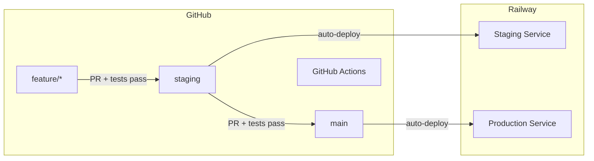

# Railway CI/CD Deployment Plan

Deploy Chillist backend to Railway with GitHub Actions CI/CD pipeline, branch protection, and staging/production environments.

## Architecture



---

## Git Workflow

### Branch Strategy

| Branch | Purpose | Protection |
|--------|---------|------------|
| `feature/*` | Development work | None |
| `staging` | Pre-production testing | PR required, CI must pass |
| `main` | Production | PR required, CI must pass |

### Rules

1. No direct push to `main` or `staging`
2. All changes via Pull Request
3. PRs require passing CI checks (lint, typecheck, tests, build)
4. `staging` → `main` merges only after verification in staging environment

---

## Phase 1: GitHub Actions

### 1.1 CI Workflow

Create `.github/workflows/ci.yml`:

```yaml
name: CI

on:
  push:
    branches: [main, staging]
  pull_request:
    branches: [main, staging]

jobs:
  test:
    runs-on: ubuntu-latest
    
    steps:
      - name: Checkout
        uses: actions/checkout@v4

      - name: Setup Node.js
        uses: actions/setup-node@v4
        with:
          node-version: '20'
          cache: 'npm'

      - name: Install dependencies
        run: npm ci

      - name: Lint
        run: npm run lint

      - name: Type check
        run: npm run typecheck

      - name: Run tests
        run: npm run test:run

      - name: Build
        run: npm run build
```

### 1.2 Deploy Workflow

Create `.github/workflows/deploy.yml`:

```yaml
name: Deploy

on:
  push:
    branches: [main, staging]

jobs:
  test:
    runs-on: ubuntu-latest
    steps:
      - uses: actions/checkout@v4
      - uses: actions/setup-node@v4
        with:
          node-version: '20'
          cache: 'npm'
      - run: npm ci
      - run: npm run lint
      - run: npm run typecheck
      - run: npm run test:run
      - run: npm run build

  deploy-staging:
    needs: test
    if: github.ref == 'refs/heads/staging'
    runs-on: ubuntu-latest
    environment: staging
    steps:
      - uses: actions/checkout@v4
      - name: Deploy to Railway Staging
        uses: bervProject/railway-deploy@main
        with:
          railway_token: ${{ secrets.RAILWAY_TOKEN }}
          service: chillist-be-staging

  deploy-production:
    needs: test
    if: github.ref == 'refs/heads/main'
    runs-on: ubuntu-latest
    environment: production
    steps:
      - uses: actions/checkout@v4
      - name: Deploy to Railway Production
        uses: bervProject/railway-deploy@main
        with:
          railway_token: ${{ secrets.RAILWAY_TOKEN }}
          service: chillist-be-production
```

---

## Phase 2: Branch Protection

Configure in GitHub repo → Settings → Branches → Add rule

### For `main` branch

- Branch name pattern: `main`
- [x] Require a pull request before merging
- [x] Require status checks to pass before merging
  - Status check: `test`
- [x] Require branches to be up to date before merging
- [x] Do not allow bypassing the above settings

### For `staging` branch

- Branch name pattern: `staging`
- [x] Require a pull request before merging
- [x] Require status checks to pass before merging
  - Status check: `test`
- [x] Require branches to be up to date before merging

---

## Phase 3: GitHub Environments

Create in GitHub repo → Settings → Environments

### staging

- No protection rules (auto-deploy on merge to staging)

### production

- Optional: Add required reviewers for extra safety

### Add Secret

Both environments need:

- `RAILWAY_TOKEN` — Get from Railway Dashboard → Account Settings → Tokens

---

## Phase 4: Railway Setup

### 4.1 Create Railway Project

1. Go to [railway.app](https://railway.app)
2. New Project → Deploy from GitHub repo
3. Select `chillist-be` repository

### 4.2 Create Two Services

**Staging Service (`chillist-be-staging`):**

Environment variables:

```
PORT=3333
HOST=0.0.0.0
NODE_ENV=staging
LOG_LEVEL=debug
```

**Production Service (`chillist-be-production`):**

Environment variables:

```
PORT=3333
HOST=0.0.0.0
NODE_ENV=production
LOG_LEVEL=info
```

### 4.3 Get Railway Token

1. Railway Dashboard → Account Settings → Tokens
2. Create new token
3. Add to GitHub: Settings → Secrets and variables → Actions → New repository secret
   - Name: `RAILWAY_TOKEN`
   - Value: `<your-token>`

---

## Phase 5: Documentation

### Create `README.md`

See README template below with:
- Local development setup instructions
- Available npm scripts
- Deployment rules and branch strategy
- Environment URLs

---

## Files to Create

| File | Description |
|------|-------------|
| `.github/workflows/ci.yml` | CI pipeline (lint, typecheck, test, build) |
| `.github/workflows/deploy.yml` | Deploy pipeline to Railway |
| `README.md` | Local setup and deployment documentation |

---

## Deployment Checklist

**GitHub Actions:**

1. [x] Create `.github/workflows/ci.yml`
2. [x] Create `.github/workflows/deploy.yml`

**GitHub Branches:**

3. [x] Create `staging` branch from `main`
4. [x] Configure branch protection for `main`
5. [x] Configure branch protection for `staging`

**GitHub Environments:**

6. [ ] Create `staging` environment
7. [ ] Create `production` environment
8. [ ] Add `RAILWAY_TOKEN` secret

**Railway:**

9. [ ] Create Railway account/project
10. [ ] Create staging service with env vars
11. [ ] Create production service with env vars
12. [ ] Connect GitHub repo

**Documentation:**

13. [x] Create `README.md` with local setup instructions
14. [x] Add deployment rules section to README

**Test:**

15. [ ] Create feature branch
16. [ ] Open PR to staging → verify CI runs
17. [ ] Merge to staging → verify deploy to staging
18. [ ] Open PR from staging to main → verify CI runs
19. [ ] Merge to main → verify deploy to production

---

## Cost Estimate

| Service | Free Tier |
|---------|-----------|
| **GitHub Actions** | 2,000 minutes/month |
| **Railway** | $5/month credits |
| **Total MVP** | $0-5/month |

---

## Current Security: CORS + API Key (Basic Protection)

**Status:** Implemented as temporary protection for MVP.

### What's in place:

- **CORS restriction**: Only allows requests from `FRONTEND_URL` in production
- **API key middleware**: Requires `x-api-key` header on all routes (except `/health`)
- **Environment variables**: `FRONTEND_URL` and `API_KEY` must be set in Railway

### Limitations:

- API key is visible in browser DevTools (frontend sends it with requests)
- Protects against bots and casual access, NOT against determined attackers
- No user-level permissions (anyone with the key has full access)

### Railway env vars to add:

```
FRONTEND_URL=https://your-frontend.vercel.app
API_KEY=<generate with: openssl rand -base64 32>
```

### Frontend integration:

```typescript
fetch(`${import.meta.env.VITE_API_URL}/plans`, {
  headers: { 'x-api-key': import.meta.env.VITE_API_KEY }
})
```

---

## Future: Proper Authentication (Required for Production)

When the app has real users and sensitive data, upgrade to proper auth:

### Option A: Supabase Auth (Recommended)
- Supabase handles user signup/login
- Backend verifies Supabase JWT tokens
- Row-level security in database

### Option B: Custom JWT Auth
- Implement signup/login endpoints
- Issue and verify JWT tokens
- Add user ownership to plans

### When to upgrade:
- Before storing personal user data
- Before handling payments
- Before public launch with real users

---

## Future: Supabase Integration (Deferred)

When ready to add user management and persistent database:

- Add Supabase project
- Add auth middleware
- Migrate from in-memory to PostgreSQL
- Add `SUPABASE_URL` and `SUPABASE_SERVICE_KEY` to Railway env vars
