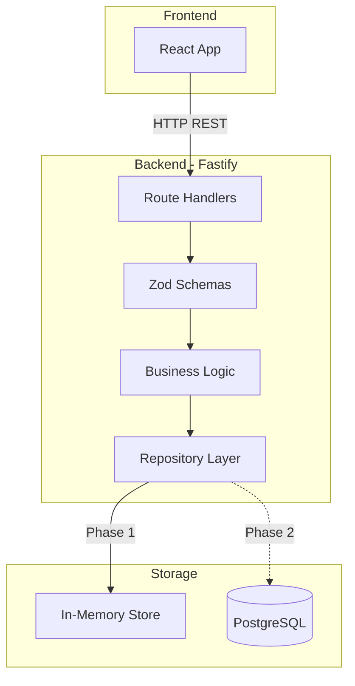

# Chillist Backend Implementation Plan

> Build a Node.js + Fastify backend for the Chillist trip planning app, starting with in-memory storage and later integrating PostgreSQL. The API will support CRUD operations for Plans, Participants, and Items.

## Progress

- [x] Initialize project: package.json, tsconfig.json, .env.example, folder structure
- [x] Set up ESLint, Prettier, Husky, Vitest
- [x] Create Fastify app with CORS, logger, health check
- [ ] Create TypeScript types and Zod schemas from frontend spec
- [ ] Implement in-memory repository with CRUD operations
- [ ] Create service layer with business logic (UUID generation, timestamps, validation)
- [ ] Implement all 15 Fastify route handlers
- [ ] Test all endpoints against frontend expectations

## Architecture Overview



## Project Structure

```
chillist-be/
├── src/
│   ├── index.ts              # Entry point
│   ├── app.ts                # Fastify app setup
│   ├── config.ts             # Environment config
│   ├── types/
│   │   └── index.ts          # All TypeScript types/interfaces
│   ├── schemas/
│   │   ├── plan.schema.ts
│   │   ├── participant.schema.ts
│   │   └── item.schema.ts
│   ├── routes/
│   │   ├── health.route.ts
│   │   ├── plans.route.ts
│   │   ├── participants.route.ts
│   │   └── items.route.ts
│   ├── services/
│   │   ├── plan.service.ts
│   │   ├── participant.service.ts
│   │   └── item.service.ts
│   └── repositories/
│       ├── repository.interface.ts
│       ├── in-memory.repository.ts
│       └── postgres.repository.ts  # Phase 2
├── tests/
│   ├── unit/
│   ├── integration/
│   └── e2e/
├── docs/
│   └── PLAN.md
├── package.json
├── tsconfig.json
├── .env.example
└── README.md
```

## API Endpoints (15 total)

### Health
- `GET /health` → `{ ok: true }`

### Plans (5)
- `GET /plans` - List all plans
- `POST /plans` - Create a new plan
- `GET /plan/:planId` - Get a single plan
- `PATCH /plan/:planId` - Update a plan
- `DELETE /plan/:planId` - Delete a plan (cascade items)

### Participants (5)
- `GET /plan/:planId/participants` - List participants for a plan
- `POST /plan/:planId/participants` - Add participant to a plan
- `GET /participants/:participantId` - Get a single participant
- `PATCH /participants/:participantId` - Update a participant
- `DELETE /participants/:participantId` - Remove a participant

### Items (5)
- `GET /plan/:planId/items` - List items for a plan
- `POST /plan/:planId/items` - Add item to a plan
- `GET /items/:itemId` - Get a single item
- `PATCH /items/:itemId` - Update an item
- `DELETE /items/:itemId` - Remove an item

## Data Models

All interfaces are defined in the frontend spec ([front-end-README.md](../front-end-README.md)):
- `Plan`, `PlanCreate`, `PlanPatch`
- `Participant`, `ParticipantCreate`, `ParticipantPatch`
- `Item` (discriminated union: EquipmentItem | FoodItem), `ItemCreate`, `ItemPatch`
- Enums: `PlanStatus`, `ParticipantRole`, `ItemCategory`, `ItemStatus`, `Unit`

## Phase 1 vs Phase 2

| Aspect | Phase 1 (Current) | Phase 2 (Future) |
|--------|-------------------|------------------|
| Storage | In-memory Map/Object | PostgreSQL |
| Persistence | Lost on restart | Persistent |
| Setup | Zero config | Requires DB setup |
| Use case | Dev/testing | Production |
